# CKA Exam Preparation

Personal study notes and practice log for the [Certified Kubernetes Administrator (CKA)](https://training.linuxfoundation.org/certification/certified-kubernetes-administrator-cka/) exam.

The layout follows the **cluster administrator / platform operations** scope of CKA: cluster lifecycle, networking, storage, security, troubleshooting, and day-two operations—rather than an application-focused developer track (see CKAD if that is your primary role).

## Topics

<strong>Advanced — CKA blueprint and how to use this table</strong>

Official domains drive what shows up on the exam; use them to **bias practice time**, not to match every lesson day one-to-one.

| Domain | Rough weight | What “good” looks like |
|--------|----------------|------------------------|
| Troubleshooting | ~30% | Fast `kubectl` flows, control plane & worker signals, CNI/DNS/storage triage |
| Cluster architecture, install & config | ~25% | `kubeadm`, upgrades, etcd backups, RBAC wiring |
| Services & networking | ~20% | Services, Ingress, NetworkPolicies, CoreDNS |
| Workloads & scheduling | ~15% | Deployments, probes, resources, affinity, priority |
| Storage | ~10% | PV/PVC/SC, volume mounts, access modes |

**Exam ergonomics:** alias `k`, practice with `--dry-run=client -o yaml` then `| kubectl apply -f -`, know [kubernetes.io/docs](https://kubernetes.io/docs/) bookmarks you will actually open during the test.

### Roadmap (25-day arc)

```mermaid
flowchart LR
  subgraph core[Core]
    D1[D01–02]
  end
  subgraph sched[Scheduling]
    D2[D03–04]
  end
  subgraph obs[Observability]
    D3[D05]
  end
  subgraph alm[App lifecycle]
    D4[D06–07]
  end
  subgraph maint[Maintenance]
    D5[D08–09]
  end
  subgraph sec[Security]
    D6[D10–12]
  end
  subgraph stor[Storage]
    D7[D13–14]
  end
  subgraph net[Networking]
    D8[D15–17]
  end
  subgraph install[Install]
    D9[D18]
  end
  subgraph fix[Troubleshooting]
    D10[D19–20]
  end
  subgraph finish[Exams]
    D11[D21–25]
  end
  core --> sched --> obs --> alm --> maint --> sec --> stor --> net --> install --> fix --> finish
```

| Day | CKA domain (guide) | Topic | Notes |
|:---:|:-------------------|-------|-------|
| 01 | Cluster architecture, install & config | Core Concepts | [Day 01](day-01/notes.md) |
| 02 | Cluster architecture, install & config | Core Concepts | [Day 02](day-02/notes.md) |
| 03 | Workloads & scheduling | Scheduling | [Day 03](day-03/notes.md) |
| 04 | Workloads & scheduling | Scheduling | [Day 04](day-04/notes.md) |
| 05 | Troubleshooting | Logging & Monitoring | [Day 05](day-05/notes.md) |
| 06 | Workloads & scheduling | Application Lifecycle Management | [Day 06](day-06/notes.md) |
| 07 | Workloads & scheduling | Application Lifecycle Management | [Day 07](day-07/notes.md) |
| 08 | Cluster architecture, install & config | Cluster Maintenance | [Day 08](day-08/notes.md) |
| 09 | Cluster architecture, install & config | Cluster Maintenance | [Day 09](day-09/notes.md) |
| 10 | Cluster architecture, install & config | Security | [Day 10](day-10/notes.md) |
| 11 | Cluster architecture, install & config | Security | [Day 11](day-11/notes.md) |
| 12 | Cluster architecture, install & config | Security | [Day 12](day-12/notes.md) |
| 13 | Storage | Storage | [Day 13](day-13/notes.md) |
| 14 | Storage | Storage | [Day 14](day-14/notes.md) |
| 15 | Services & networking | Networking | [Day 15](day-15/notes.md) |
| 16 | Services & networking | Networking | [Day 16](day-16/notes.md) |
| 17 | Services & networking | Networking | [Day 17](day-17/notes.md) |
| 18 | Cluster architecture, install & config | Install & Kubeadm | [Day 18](day-18/notes.md) |
| 19 | Troubleshooting | Troubleshooting | [Day 19](day-19/notes.md) |
| 20 | Troubleshooting | Troubleshooting | [Day 20](day-20/notes.md) |
| 21 | Mixed | Other Topics | [Day 21](day-21/notes.md) |
| 22 | Mixed | Lightning Labs | [Day 22](day-22/notes.md) |
| 23 | Mixed | Mock Exam 1 | [Day 23](day-23/notes.md) |
| 24 | Mixed | Mock Exam 2 | [Day 24](day-24/notes.md) |
| 25 | Mixed | Mock Exam 3 | [Day 25](day-25/notes.md) |

## Resources

- [Kubernetes Official Docs](https://kubernetes.io/docs/)
- [killer.sh](https://killer.sh/)
