# Day 0 — Orientation & CKA Map

Start here. This module helps you understand what the CKA exam is, what you need before you begin studying, and how to use this study guide effectively.

---

## What is Kubernetes?

Kubernetes (often shortened to “K8s”) is an open-source platform that **automates deploying, scaling, and managing containerized applications**. Think of it like this:

- You have an application packaged inside a **container** (like a Docker container).
- You want to run many copies of that container, keep them healthy, and update them without downtime.
- Kubernetes is the system that does all of that for you automatically.

In a real-world setup, Kubernetes runs across multiple servers (called **nodes**) and groups them into a **cluster**. It decides which node runs which container, restarts containers that crash, scales them up when traffic increases, and rolls out updates without dropping user requests.

---

## What is the CKA Exam?

The **Certified Kubernetes Administrator (CKA)** is a certification by the Cloud Native Computing Foundation (CNCF) and the Linux Foundation. It proves you can:

- Set up and maintain a Kubernetes cluster
- Handle networking, storage, and security for workloads
- Troubleshoot broken clusters under time pressure

**Key facts about the exam:**

| Detail | Info |
|--------|------|
| Format | Performance-based (hands-on tasks in a real terminal) |
| Duration | 2 hours |
| Passing score | 66% |
| Open book? | Yes — you can access the official Kubernetes docs during the exam |
| Validity | 2 years from date of passing |
| Retake | One free retake included with your purchase |
| Cost | ~$395 USD (includes one retake + killer.sh simulator access) |

This is **not** a multiple-choice exam. You solve real tasks in a live Kubernetes environment using `kubectl` and other CLI tools. Speed and accuracy both matter.

---

## Prerequisites (What You Should Know Before Starting)

You do **not** need to be a Kubernetes expert before starting this guide — that's what we're building toward. But you should be comfortable with:

### Linux Basics
- Navigating the filesystem (`cd`, `ls`, `cat`, `find`)
- Editing files with `vim` or `nano`
- Understanding file permissions (`chmod`, `chown`)
- Reading logs (`journalctl`, `tail -f`)
- Basic networking (`curl`, `ip`, `ss`, `nslookup`)

### Containers (Docker)
- What a container is and how it differs from a virtual machine
- Building and running a Docker container (`docker run`, `docker build`)
- Basic understanding of container images and registries

### YAML
- YAML is the language Kubernetes uses for configuration files
- You should be able to read and write YAML without constantly looking up syntax
- Know the difference between lists (`-`) and maps (`key: value`)

### Networking Fundamentals
- IP addresses, subnets, ports
- How DNS works at a high level
- What a load balancer does

If any of these feel shaky, spend a few days on them before diving into Module 01. The CKA exam assumes Linux command-line fluency.

---

## Setting Up Your Practice Environment

You need a working Kubernetes cluster to practice. Here are your options, from simplest to most realistic:

### Option 1: Minikube (Easiest to start)
Runs a single-node Kubernetes cluster on your laptop.
```bash
# Install minikube (macOS example)
brew install minikube

# Start a cluster
minikube start

# Verify it works
kubectl get nodes
```

### Option 2: kind (Kubernetes in Docker)
Runs Kubernetes nodes as Docker containers. Lightweight and fast.
```bash
# Install kind
brew install kind

# Create a cluster with 1 control-plane + 2 workers
kind create cluster --name cka-practice --config - <<EOF
kind: Cluster
apiVersion: kind.x-k8s.io/v1alpha4
nodes:
- role: control-plane
- role: worker
- role: worker
EOF

kubectl get nodes
```

### Option 3: kubeadm on VMs (Most exam-realistic)
Spin up 2–3 Linux VMs (using Vagrant, Multipass, or a cloud provider) and bootstrap a cluster with `kubeadm`. This is exactly how the exam environment works. We cover this in Module 18, but you can start with Option 1 or 2 and revisit later.

### Option 4: Cloud Playground
- [killer.sh](https://killer.sh/) — comes free with your CKA exam purchase (2 sessions)
- [KodeKloud playgrounds](https://kodekloud.com/) — browser-based labs
- [Play with Kubernetes](https://labs.play-with-k8s.com/) — free, temporary clusters

**Recommendation:** Start with `kind` or `minikube` for daily practice. Use `kubeadm` on VMs closer to exam time to build muscle memory for cluster bootstrapping.

---

## CKA Exam Domains (What Gets Tested)

The exam is divided into five domains. Each domain has a **weight** — this tells you how many marks come from that area. Focus your study time proportionally.

| Domain | Weight | What it covers |
|--------|--------|----------------|
| **Troubleshooting** | ~30% | Diagnosing broken nodes, pods, networking, DNS, and control-plane components. This is the biggest section — you must be fast with `kubectl` and reading logs. |
| **Cluster Architecture, Installation & Configuration** | ~25% | Setting up clusters with `kubeadm`, performing upgrades, backing up etcd, managing RBAC (who can do what), and understanding how the control plane works. |
| **Services & Networking** | ~20% | Creating Services (ClusterIP, NodePort, LoadBalancer), Ingress resources, NetworkPolicies (firewall rules for pods), and understanding how CoreDNS resolves names inside the cluster. |
| **Workloads & Scheduling** | ~15% | Deploying applications with Deployments/DaemonSets/StatefulSets, configuring health probes, resource limits, node affinity, taints and tolerations. |
| **Storage** | ~10% | PersistentVolumes, PersistentVolumeClaims, StorageClasses, volume mounts, and access modes. |

### How to use these weights

- Troubleshooting is 30% of your grade. If you can troubleshoot quickly, you have a massive advantage.
- Don't skip Storage because it's “only 10%” — those are free marks if you understand PV/PVC basics.
- The domains overlap: troubleshooting a networking issue requires knowledge from both Troubleshooting AND Networking domains.

---

## Exam-Day Tips and Ergonomics

These small habits save significant time during the 2-hour exam:

### 1. Set up aliases immediately
```bash
# The exam often pre-configures this, but set it yourself if not
alias k=kubectl
export do=”--dry-run=client -o yaml”

# Now you can do:
k run nginx --image=nginx $do > pod.yaml
```

### 2. Use imperative commands to generate YAML
Don't write YAML from scratch during the exam. Generate it, then edit:
```bash
# Generate a pod manifest
kubectl run mypod --image=nginx --dry-run=client -o yaml > pod.yaml

# Generate a deployment manifest
kubectl create deployment myapp --image=nginx --replicas=3 --dry-run=client -o yaml > deploy.yaml

# Generate a service manifest
kubectl expose deployment myapp --port=80 --target-port=8080 --dry-run=client -o yaml > svc.yaml
```

### 3. Know how to navigate the Kubernetes docs
You can open `https://kubernetes.io/docs/` during the exam. Practice finding these pages quickly:
- **Cheat sheet:** `kubernetes.io/docs/reference/kubectl/cheatsheet/`
- **Pod spec:** search “Pod v1 core” in the docs
- **NetworkPolicy examples:** search “network policies”
- **PV/PVC:** search “persistent volumes”

### 4. Use `kubectl explain` instead of the docs when possible
```bash
# Shows the fields available for a pod spec
kubectl explain pod.spec

# Go deeper
kubectl explain pod.spec.containers.livenessProbe
```
This is faster than switching to a browser tab.

### 5. Context switching
The exam gives you multiple clusters. Always run the provided `kubectl config use-context` command at the start of each question. Forgetting this is one of the most common reasons people lose marks.

### 6. Time management
- 2 hours, ~15–20 questions
- Not all questions are equal weight — check the marks
- If stuck for more than 5 minutes, flag it and move on
- Come back to flagged questions with remaining time

---

## How to Use This Study Guide

The `day-*` folders are **ordered study modules**, not a rigid 25-day calendar. Here's how to approach them:

- **Go at your own pace.** A single module might take you one evening or an entire week. That's fine.
- **Follow the order** if you're new. Later modules build on earlier ones.
- **Jump around** if you already have experience. Use the domain weights above to prioritize weak areas.
- **Practice in a real cluster.** Reading alone won't prepare you — every module should involve running commands.

### Suggested module flow

One block can span hours or weeks depending on you. Arrows show the **default sequence** — deviate anytime based on your needs.

```mermaid
flowchart LR
  subgraph core[Core]
    M1[M01–02]
  end
  subgraph sched[Scheduling]
    M2[M03–04]
  end
  subgraph obs[Observability]
    M3[M05]
  end
  subgraph alm[App lifecycle]
    M4[M06–07]
  end
  subgraph maint[Maintenance]
    M5[M08–09]
  end
  subgraph sec[Security]
    M6[M10–12]
  end
  subgraph stor[Storage]
    M7[M13–14]
  end
  subgraph net[Networking]
    M8[M15–17]
  end
  subgraph install[Install]
    M9[M18]
  end
  subgraph fix[Troubleshooting]
    M10[M19–20]
  end
  subgraph finish[Mocks & extras]
    M11[M21–25]
  end
  core --> sched --> obs --> alm --> maint --> sec --> stor --> net --> install --> fix --> finish
```



---

## Module Index

| Mod | CKA Domain | Topic | Notes |
|:---:|:-----------|-------|-------|
| 0 | Mixed | Orientation (this file) | [day-0](notes.md) |
| 01 | Cluster architecture, install & config | Core Concepts — Pods, ReplicaSets, Deployments, Namespaces | [day-01](../day-01/notes.md) |
| 02 | Cluster architecture, install & config | Core Concepts — Services, kubectl basics | [day-02](../day-02/notes.md) |
| 03 | Workloads & scheduling | Scheduling — Labels, Selectors, Taints, Tolerations | [day-03](../day-03/notes.md) |
| 04 | Workloads & scheduling | Scheduling — Node Affinity, Resource Limits | [day-04](../day-04/notes.md) |
| 05 | Troubleshooting | Logging & Monitoring — Metrics Server, kubectl top, logs | [day-05](../day-05/notes.md) |
| 06 | Workloads & scheduling | App Lifecycle — Rolling Updates, Rollbacks | [day-06](../day-06/notes.md) |
| 07 | Workloads & scheduling | App Lifecycle — ConfigMaps, Secrets, Env Vars | [day-07](../day-07/notes.md) |
| 08 | Cluster architecture, install & config | Cluster Maintenance — OS Upgrades, Drain/Cordon | [day-08](../day-08/notes.md) |
| 09 | Cluster architecture, install & config | Cluster Maintenance — Cluster Upgrades, etcd Backup & Restore | [day-09](../day-09/notes.md) |
| 10 | Cluster architecture, install & config | Security — Authentication, Authorization, RBAC | [day-10](../day-10/notes.md) |
| 11 | Cluster architecture, install & config | Security — Service Accounts, Image Security | [day-11](../day-11/notes.md) |
| 12 | Cluster architecture, install & config | Security — Security Contexts, Network Policies | [day-12](../day-12/notes.md) |
| 13 | Storage | Storage — Volumes, PersistentVolumes, PersistentVolumeClaims | [day-13](../day-13/notes.md) |
| 14 | Storage | Storage — StorageClasses, Dynamic Provisioning | [day-14](../day-14/notes.md) |
| 15 | Services & networking | Networking — Pod Networking, CNI Basics | [day-15](../day-15/notes.md) |
| 16 | Services & networking | Networking — Services Deep Dive, CoreDNS | [day-16](../day-16/notes.md) |
| 17 | Services & networking | Networking — Ingress, NetworkPolicies | [day-17](../day-17/notes.md) |
| 18 | Cluster architecture, install & config | Install — kubeadm Cluster Setup from Scratch | [day-18](../day-18/notes.md) |
| 19 | Troubleshooting | Troubleshooting — Application & Pod Failures | [day-19](../day-19/notes.md) |
| 20 | Troubleshooting | Troubleshooting — Control Plane & Worker Node Failures | [day-20](../day-20/notes.md) |
| 21 | Mixed | Other Topics — JSON Path, Advanced kubectl | [day-21](../day-21/notes.md) |
| 22 | Mixed | Lightning Labs — Timed Multi-Topic Practice | [day-22](../day-22/notes.md) |
| 23 | Mixed | Mock Exam 1 | [day-23](../day-23/notes.md) |
| 24 | Mixed | Mock Exam 2 | [day-24](../day-24/notes.md) |
| 25 | Mixed | Mock Exam 3 | [day-25](../day-25/notes.md) |

---

## Recommended Resources

| Resource | What it's for |
|----------|---------------|
| [Kubernetes Official Docs](https://kubernetes.io/docs/) | Your primary reference — also the only site allowed during the exam |
| [CKA Curriculum (GitHub)](https://github.com/cncf/curriculum) | The official exam blueprint — check this for any updates to domain weights |
| [killer.sh](https://killer.sh/) | Exam simulator — harder than the real exam, excellent practice |
| [kubectl Cheat Sheet](https://kubernetes.io/docs/reference/kubectl/cheatsheet/) | Bookmark this — you'll use it during the exam |
| [KodeKloud CKA Course](https://kodekloud.com/) | Popular structured video course with hands-on labs |
| [Mumshad's Udemy CKA Course](https://www.udemy.com/course/certified-kubernetes-administrator-with-practice-tests/) | Same content as KodeKloud, on Udemy platform |

---

## Topics Covered in This Module

- What Kubernetes is and why it exists
- What the CKA exam tests and how it's structured
- Prerequisites you need before starting
- How to set up a practice environment
- CKA domain weights and how to allocate study time
- Exam-day tips for speed and accuracy
- How to navigate this study guide

## Key Concepts

- **Cluster:** A group of machines (nodes) running Kubernetes together
- **Node:** A single machine in the cluster (either a control-plane node or a worker node)
- **Control Plane:** The brain of the cluster — makes scheduling decisions, stores state, runs the API server
- **Worker Node:** Where your actual application containers run
- **Pod:** The smallest deployable unit in Kubernetes — one or more containers running together
- **kubectl:** The command-line tool for interacting with Kubernetes
- **kubeadm:** The tool for bootstrapping (setting up) a Kubernetes cluster from scratch

## Commands Practiced

```bash
# Verify your cluster is running
kubectl get nodes

# Check cluster information
kubectl cluster-info

# List everything in all namespaces
kubectl get all --all-namespaces

# Quick check that kubectl can talk to the cluster
kubectl version --short
```

## Gotchas / Things to Remember

- The CKA is hands-on, not multiple choice — you must practice in a real terminal
- You can access kubernetes.io/docs during the exam, but not any other sites
- Always verify which cluster context you're in before answering a question
- Speed matters — 2 hours goes fast when you're troubleshooting real clusters
- The exam environment uses a Linux terminal; if you're on macOS/Windows, practice in Linux
- `kubectl explain` is faster than searching the docs for field names

## Lab Status

- [ ] Installed kubectl
- [ ] Set up a local cluster (minikube, kind, or kubeadm)
- [ ] Ran `kubectl get nodes` and verified the cluster is healthy
- [ ] Practiced `kubectl explain pod.spec`
- [ ] Bookmarked the Kubernetes docs cheat sheet
- [ ] Orientation module complete
