```mermaid
flowchart LR
  subgraph core[Core]
    M1[M01–02]
  end
  subgraph sched[Scheduling]
    M2[M03–04]
  end
  subgraph obs[Observability]
    M3[M05]
  end
  subgraph alm[App lifecycle]
    M4[M06–07]
  end
  subgraph maint[Maintenance]
    M5[M08–09]
  end
  subgraph sec[Security]
    M6[M10–12]
  end
  subgraph stor[Storage]
    M7[M13–14]
  end
  subgraph net[Networking]
    M8[M15–17]
  end
  subgraph install[Install]
    M9[M18]
  end
  subgraph fix[Troubleshooting]
    M10[M19–20]
  end
  subgraph finish[Mocks & extras]
    M11[M21–25]
  end
  core --> sched --> obs --> alm --> maint --> sec --> stor --> net --> install --> fix --> finish
```

# Day 0 — Orientation & CKA map

Read this module first to align how you spend time with what the exam actually weights. The numbered `day-*` folders are **modules**, not literal calendar days: follow them in order, jump by weak area, or stretch a single folder across multiple study sessions—whatever fits your schedule.

## CKA blueprint (how to use this)

Official domains drive what shows up on the exam; use them to **bias practice time**, not to assume one folder equals one calendar day.

| Domain | Rough weight | What “good” looks like |
|--------|----------------|------------------------|
| Troubleshooting | ~30% | Fast `kubectl` flows, control plane & worker signals, CNI/DNS/storage triage |
| Cluster architecture, install & config | ~25% | `kubeadm`, upgrades, etcd backups, RBAC wiring |
| Services & networking | ~20% | Services, Ingress, NetworkPolicies, CoreDNS |
| Workloads & scheduling | ~15% | Deployments, probes, resources, affinity, priority |
| Storage | ~10% | PV/PVC/SC, volume mounts, access modes |

## Exam ergonomics

- Alias `k` for `kubectl` in the exam environment if allowed / preconfigured.
- Prefer `kubectl create ... --dry-run=client -o yaml` (or `run`) then pipe to `kubectl apply -f -` for speed and fewer typos.
- Decide in advance which [Kubernetes docs](https://kubernetes.io/docs/) sections you will actually open during the test and practice finding them.

## Suggested module flow (not a timetable)

One block can span hours or weeks depending on you; arrows are a **default sequence** you can deviate from anytime.



## Module index (jump links)

| Mod | CKA domain (guide) | Topic | Notes |
|:---:|:-------------------|-------|-------|
| 0 | Mixed | Orientation (this file) | [day-0](notes.md) |
| 01 | Cluster architecture, install & config | Core Concepts | [day-01](../day-01/notes.md) |
| 02 | Cluster architecture, install & config | Core Concepts | [day-02](../day-02/notes.md) |
| 03 | Workloads & scheduling | Scheduling | [day-03](../day-03/notes.md) |
| 04 | Workloads & scheduling | Scheduling | [day-04](../day-04/notes.md) |
| 05 | Troubleshooting | Logging & Monitoring | [day-05](../day-05/notes.md) |
| 06 | Workloads & scheduling | Application Lifecycle Management | [day-06](../day-06/notes.md) |
| 07 | Workloads & scheduling | Application Lifecycle Management | [day-07](../day-07/notes.md) |
| 08 | Cluster architecture, install & config | Cluster Maintenance | [day-08](../day-08/notes.md) |
| 09 | Cluster architecture, install & config | Cluster Maintenance | [day-09](../day-09/notes.md) |
| 10 | Cluster architecture, install & config | Security | [day-10](../day-10/notes.md) |
| 11 | Cluster architecture, install & config | Security | [day-11](../day-11/notes.md) |
| 12 | Cluster architecture, install & config | Security | [day-12](../day-12/notes.md) |
| 13 | Storage | Storage | [day-13](../day-13/notes.md) |
| 14 | Storage | Storage | [day-14](../day-14/notes.md) |
| 15 | Services & networking | Networking | [day-15](../day-15/notes.md) |
| 16 | Services & networking | Networking | [day-16](../day-16/notes.md) |
| 17 | Services & networking | Networking | [day-17](../day-17/notes.md) |
| 18 | Cluster architecture, install & config | Install & Kubeadm | [day-18](../day-18/notes.md) |
| 19 | Troubleshooting | Troubleshooting | [day-19](../day-19/notes.md) |
| 20 | Troubleshooting | Troubleshooting | [day-20](../day-20/notes.md) |
| 21 | Mixed | Other Topics | [day-21](../day-21/notes.md) |
| 22 | Mixed | Lightning Labs | [day-22](../day-22/notes.md) |
| 23 | Mixed | Mock Exam 1 | [day-23](../day-23/notes.md) |
| 24 | Mixed | Mock Exam 2 | [day-24](../day-24/notes.md) |
| 25 | Mixed | Mock Exam 3 | [day-25](../day-25/notes.md) |

## Topics Covered

- CKA domain weights and how they map to this study plan
- Suggested module flow and index (folders `day-*`, pace is yours)

## Key Concepts


## Commands Practiced

```bash

```

## Gotchas / Things to Remember


## Lab Status

- [ ] Orientation module complete
